# Guides PDF SO-ARM 101

Documentation complète pour l'installation, configuration et utilisation des robots SO-ARM 101.

## 📚 Guides Disponibles

### 📘 **Phase 1 - Installation LeRobot**
Installation complète de l'environnement de développement.
- Installation Miniconda
- Configuration Python 3.10
- Installation LeRobot et Dynamixel SDK
- Installation des scripts SEM (étape 4)
- Tests et vérifications

**Points clés :**
- Environnement conda `lerobot`
- Support servos Feetech STS3215
- Compatible Ubuntu 20.04+

### 📙 **Phase 2 - Configuration des Servos**
Configuration individuelle de chaque servo avec son ID.
- Attribution des IDs (1-6)
- Configuration des ratios spécifiques
- Tests de mouvement
- Un servo à la fois

**Ratios Leader :**
- Servos 1,3 : 1:191 (C044)
- Servo 2 : 1:345 (C001)
- Servos 4,5,6 : 1:147 (C046)

**Ratios Follower :**
- Tous : 1:345

### 📗 **Phase 3 - Calibration**
Définition des limites de mouvement pour chaque servo.
- Calibration manuelle des positions min/max
- Sauvegarde automatique
- Test de centrage
- Validation des amplitudes

**Fichiers générés :**
- `~/.cache/calibration/so101/leader_calibration.json`
- `~/.cache/calibration/so101/follower_calibration.json`

### 📕 **Phase 4 - Tests et Contrôle**
Validation et contrôle manuel des robots.
- Contrôle par clavier
- Mouvements fluides
- Positions prédéfinies
- Tests de sécurité

**Scripts utilisés :**
- `SEM_so101_control_leader.py`
- `SEM_so101_control_follower.py`

## 🚀 Guides à Venir

### 📘 **Phase 5 - Téléopération**
Contrôle du Follower par le Leader (synchronisation)

### 📙 **Phase 6 - Caméras**
Installation et configuration du système de vision

### 📗 **Phase 7 - Enregistrement**
Capture de démonstrations pour l'apprentissage

### 📕 **Phase 8 - Configuration IA**
Mise en place du système ACT (Action Chunking Transformers)

### 📘 **Phase 9 - Entraînement**
Formation du modèle d'IA sur les démonstrations

### 📙 **Phase 10 - Autonomie**
Déploiement du robot en mode autonome

## 📋 Workflow Recommandé

```mermaid
graph LR
    A[Phase 1<br/>Installation] --> B[Phase 2<br/>Configuration]
    B --> C[Phase 3<br/>Calibration]
    C --> D[Phase 4<br/>Tests]
    D --> E[Phase 5<br/>Téléopération]
    E --> F[Phases 6-10<br/>IA & Autonomie]
```

## 🔧 Matériel Requis

- 2x Bras SO-ARM 101
- 2x Adaptateurs USB Feetech
- 2x Alimentations 5V 3A
- 1x PC Ubuntu 20.04+
- 2x Caméras USB (phases avancées)

## 📌 Notes Importantes

1. **Suivre l'ordre** : Les phases sont séquentielles
2. **Sauvegardes** : Garder les fichiers de calibration
3. **Un robot à la fois** : Pour les phases 2-3
4. **Alimentation** : Vérifier les LEDs avant utilisation

---
Service Ecoles Médias - Genève
